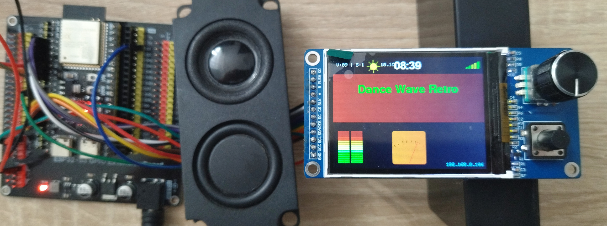
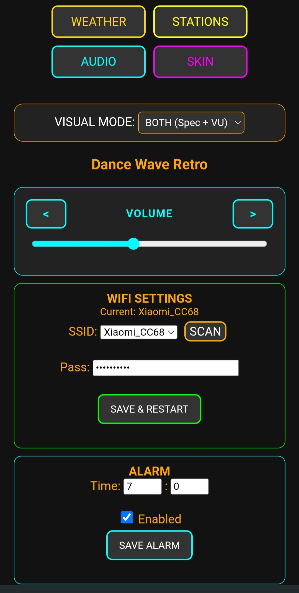
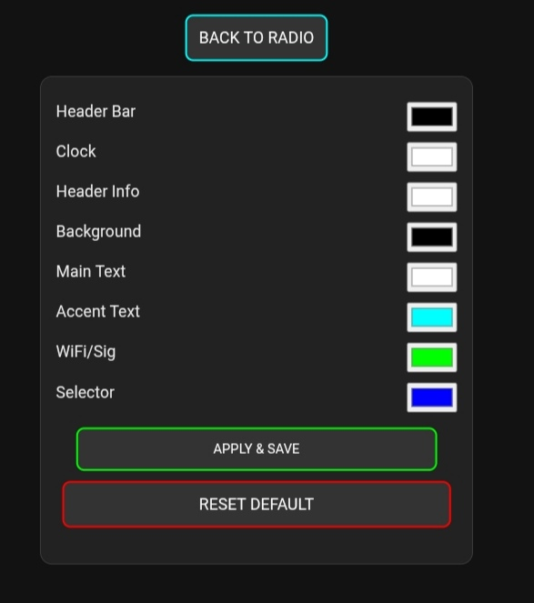
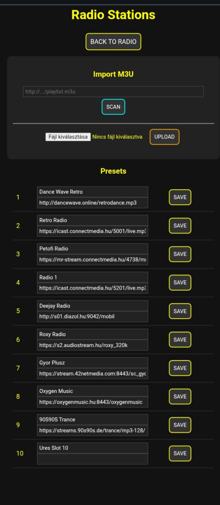
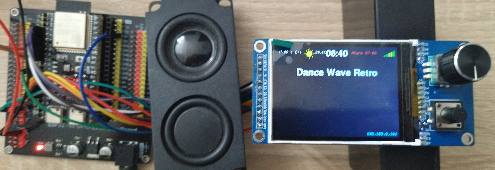

# ESP32-S3-Internet-Radio
A high-performance, feature-rich internet radio based on the ESP32-S3, featuring a customized Skin Engine, real-time audio visualization, and a smart stereo DAC configuration.
# 📻 ESP32-S3 Internet Radio (N16R8)

A high-performance internet radio based on the ESP32-S3, featuring a customized Skin Engine, real-time audio visualization, and a smart stereo DAC configuration.

---

## 📸 Gallery

  
  

  
  
  

*(Note: The full technical documentation and pinout are available below.)*

---

## ✨ Main Features
* **Custom Skin Engine:** Change colors via WebGUI in real-time[cite: 2].
* **Stereo Sound:** Dual MAX98357A setup with the 100k Ohm resistor trick[cite: 2].
* **Visuals:** Spectrum Analyzer and Analog VU meter on a 320x240 TFT[cite: 2].
* **Management:** Web-based station, Wi-Fi, and Alarm configuration[cite: 2].
